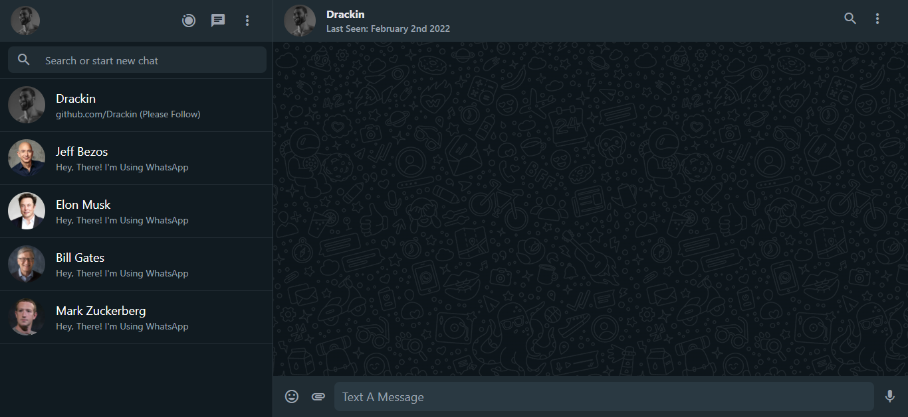

# WhatsApp UI Clone

## Made with Nuxt.js and WindiCSS by Drackin

This repo protected by Licence, please do not share without permission.



## It was not made for any profit.

### It's Just UI of WhatsApp. Not The App Itself.

# How to Setup?

Note: This Project Using Yarn Package Manager. Please use Yarn.

#### First write this command to Terminal for install all modules:

```cmd
yarn install
```

#### Okay. Next Step (First boot may take a long time):
```cmd
yarn dev
```

#### Finally, when the project starts, go: [http://localhost:3000](http://localhost:3000) (or what is written in terminal)